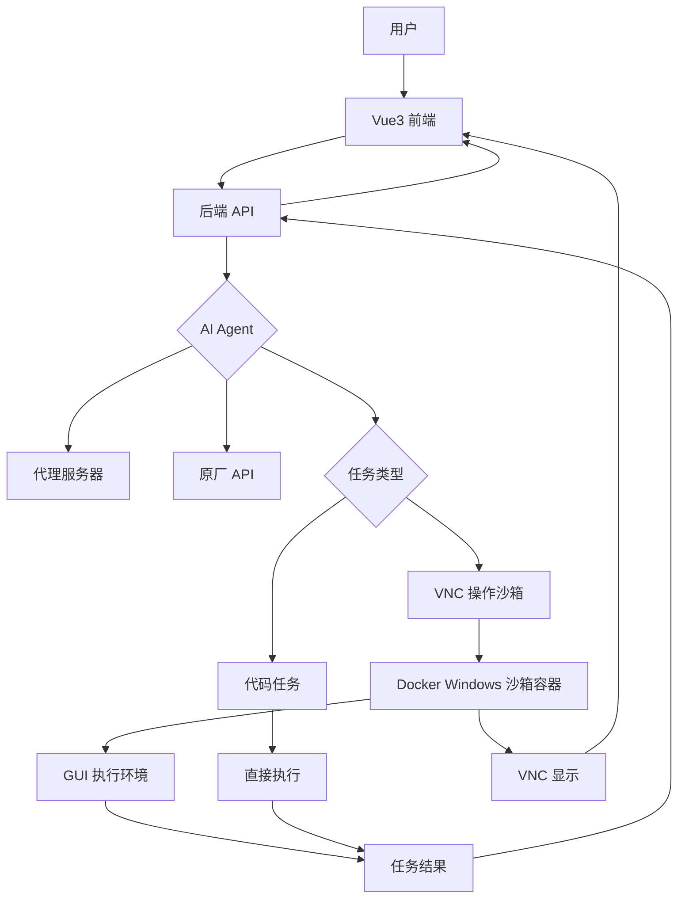

# AI Agent 对话问答系统架构设计

## 概述

本系统是一个基于Vue3前端的AI Agent对话问答平台，后台支持代理服务器或直接API调用，通过VNC连接Docker Windows沙箱容器执行GUI任务。系统旨在提供安全的对话交互和任务执行环境。

## 系统架构

## 前后端交互方式

- **对话交互**：前端通过WebSocket或HTTP POST发送用户消息，后端返回AI回复。
- **VNC显示**：前端通过noVNC客户端连接VNC服务器，实时流显示沙箱界面。
- **任务结果**：后端通过WebSocket推送任务执行结果和文件下载链接。

## 组件描述

### 前端 (Vue3)
- 提供对话界面，用户输入问题，显示AI回复。
- 集成noVNC客户端，显示沙箱VNC流，用户仅查看。
- 使用WebSocket或HTTP与后端通信。
- 支持实时对话、任务结果显示和VNC界面展示。

### 后端 (Python)
- 处理前端请求，调用AI Agent。
- 支持配置代理服务器或直接API调用。
- 管理VNC连接，启动Docker容器执行任务。
- **调度机制**：使用Celery或类似任务队列调度AI Agent任务，确保异步处理和资源管理。

### AI Agent
- 对话问答机器人，基于AI模型（如OpenAI GPT）。
- 根据用户问题生成回复，或识别需要执行任务（代码生成或GUI操作）。
- 对于简单任务（如生成Excel），直接用代码库执行；复杂任务用沙箱GUI。
- **可能需要VNC的任务**：操作特定Windows应用（如AutoCAD绘图）、需要视觉交互的任务、无法用API完成的GUI操作、测试软件界面等。

### Docker 沙箱容器 (Windows/Linux)
- 隔离环境，运行GUI或代码任务。
- Windows：安装应用和运行时，通过VNC操作。
- Linux：运行X11桌面或浏览器，通过VNC显示部署画面。
- 通过VNC提供远程访问界面。

### VNC 连接
- 提供沙箱环境的实时显示给用户查看，用户不能操作。
- AI Agent可以操作沙箱环境执行任务。
- 确保安全访问，防止恶意代码影响主机。
- **服务器**：使用noVNC (web-based VNC) 或 TightVNC，集成到Docker容器。
- **配置**：分辨率1024x768，端口5900+，通过WebSocket流传输。
- **承载能力**：单服务器（4核8GB）可支持10-20并发用户（每个用户一个沙箱容器和VNC会话，占用一个端口，如5901-5920），取决于硬件和网络。
- **显示部署画面**：在Linux沙箱中运行Xvfb虚拟显示 + Firefox/Chrome浏览器，通过VNC流传输到前端显示部署后的web应用或界面。

## 解决方案

1. **前端开发**：使用Vue3 + Composition API构建对话界面。
2. **后端开发**：使用Flask或FastAPI构建API，集成AI SDK。
3. **AI集成**：配置代理和原厂API选项。
4. **容器化**：创建Docker镜像，包含VNC服务器和运行时。
5. **AI Agent和调度**：AI Agent作为核心，处理对话逻辑和任务识别。后端使用任务调度器（如Celery）管理AI任务和沙箱执行，确保并发和资源控制。
6. **AI Agent操作沙箱**：AI Agent根据任务类型选择执行方式。对于代码任务（如生成Excel），直接在后端用库执行；对于GUI任务，通过VNC连接模拟操作。
   - **代码任务流程**：
     1. AI生成代码（如用openpyxl生成Excel）。
     2. 后端执行代码，生成文件。
     3. 返回结果。
   - **GUI任务流程**：
     1. 用户提问，后端调用AI Agent。
     2. AI判断需要GUI操作，生成操作指令。
     3. 后端启动VNC客户端连接沙箱容器。
     4. 使用库如vncdotool发送鼠标/键盘事件模拟操作。
     5. 截取屏幕或等待结果，返回给AI。
     6. AI处理结果，返回用户。
6. **VNC显示**：容器运行VNC服务器，前端通过WebSocket或HTTP流显示沙箱界面，用户仅查看。
7. **安全**：实施沙箱隔离，限制资源使用，代码审查。
8. **部署**：使用Docker Compose编排服务。

## 技术栈
- 前端：Vue3, Axios/WebSocket
- 后端：Python, Flask/FastAPI, Celery (调度)
- AI：OpenAI API 或类似
- 容器：Docker (Windows containers)
- VNC：TightVNC, vncdotool (Python VNC客户端)
- 代理：可选HTTP代理

1tmux + WebSocket（最强大）
2xterm.js + 后端PTY（现代标准）
3简单的日志流（只读）
4Docker容器终端流
script命令录制（用于教学/演示）
控制台流比浏览器流更简单，因为：
数据量小：文本 vs 像素数据
协议简单：ANSI转义序列 vs 图像压缩
实现成熟：xterm.js + node-pty已成标准
延迟更低：文本传输更快
推荐方案：
教学/演示：websocketd + script（最简单）
在线IDE：xterm.js + node-pty（标准方案）
生产环境：容器隔离 + 网关服务 + 安全限制
监控日志：Server-Sent Events 或 WebSocket + tail -f
核心就是：PTY（伪终端） + WebSocket + ANSI终端渲染，这是现代在线终端的技术基石。

用户界面（只读观察）
    ├── 实时终端输出流（WebSocket）
    ├── AI思考过程流（Markdown渲染）
    ├── 代码编辑实时预览
    └── 执行结果可视化
          ↑
          | 全流程数据流
          ↓
[AI Agent控制器]
    ├── 思考分析模块（LLM）
    ├── 代码生成模块
    ├── 命令执行模块（PTY）
    ├── 结果评估模块
    └── 学习反馈模块
          ↑
          | 实际操作
          ↓
[沙箱环境]
    ├── 容器/Docker隔离
    ├── 文件系统
    ├── 开发工具链
    └── 运行环境

如果是前端展示  AIAGENT 思考过程，操作流程，linux 文件树，Linux命令行，  Linux  虚拟谷歌浏览器。 

